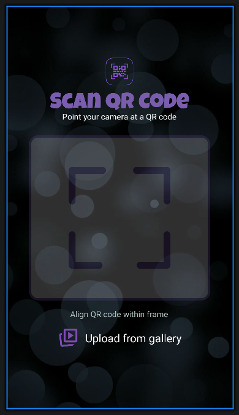
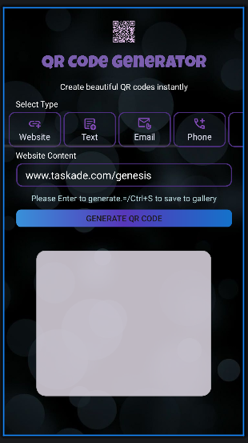
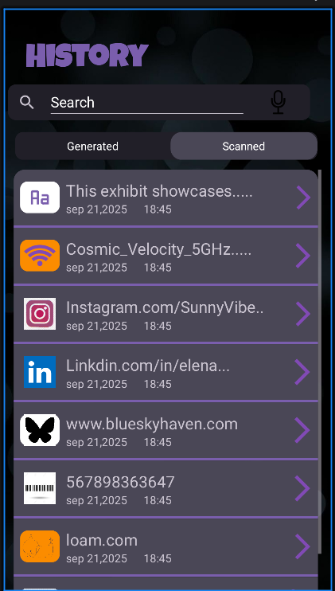

<div align="center">


# 🔮 QR Code Scanner & Generator

**A sleek, dark-themed Android app to scan, generate, and manage your QR codes.**

</div>

<br>

<table align="center">
  <tr>
    <td align="center"><br><sub><i>Scan</i></sub></td>
    <td align="center"><br><sub><i>Generate</i></sub></td>
    <td align="center"><br><sub><i>History</i></sub></td>
  </tr>
</table>

---

## 🚧 Project Status

The full UI for all three screens (Scan, Generate, History) is built and styled. Functionality is still being wired up:

| Screen | UI | Logic |
|---|---|---|
| Scan | ✅ Done | 🟡 Pending — camera permission & live scanning |
| Generate | ✅ Done | 🟡 Pending — QR generation logic |
| History | ✅ Done | 🟡 Pending — search & real data source |

---

## ✨ Planned Features
*(Design is finished; these describe intended behavior once wired up.)*

### 📷 Scan
- Live camera viewfinder with an alignment frame to guide QR placement
- Upload a QR code image from your gallery instead of scanning live
- Clean, minimal scanning UI with clear on-screen instructions

### 🔲 Generate
- Create QR codes for multiple content types: **Website, Text, Email, Phone**, and more
- Live input field with contextual hints (e.g. paste a URL, hit Enter to generate)
- Keyboard shortcut support — `Ctrl+S` to save the generated code straight to your gallery
- Instant preview of the generated QR code

### 🕘 History
- Unified history view with two tabs: **Generated** and **Scanned**
- Search bar to quickly filter past entries
- Smart icons per entry type — website, Wi-Fi network, Instagram, LinkedIn, plain text, barcode, and more
- Each entry shows a timestamp and opens into full detail on tap

---

## 🎨 Design System

The entire app follows one consistent dark, glassmorphism-inspired theme:

| Token | Value | Usage |
|---|---|---|
| 🟣 Primary Accent | `#7A5EAD` | Headers, buttons, dividers, highlights |
| ⚫ Background | Dark / near-black with bokeh overlay | All screens |
| ⚪ Text (primary) | `#FFFFFF` | Body text, hints |
| 🔤 Display Font | *Luckiest Guy* | Screen titles (`SCAN QR CODE`, `HISTORY`, etc.) |
| 🟪 Cards | Rounded, semi-transparent purple-grey | List rows, input fields, preview boxes |

Consistent touches across every screen:
- Soft bokeh/blur background for visual depth
- Rounded corners on all cards, inputs, and buttons
- Thin purple `MaterialDivider` lines separating list content
- Bold, chunky display type for headers vs. clean sans-serif for body copy

---

## 🛠️ Tech Stack

- **Language:** Kotlin
- **UI:** Android XML layouts with `ConstraintLayout`
- **Lists:** `RecyclerView` for dynamic, searchable history
- **Components:** Material Components (`MaterialDivider`, etc.)
- **Min SDK:** _add your `minSdkVersion`_
- **Target SDK:** _add your `targetSdkVersion`_

---

## 📦 Project Structure

```
app/
├── src/main/
│   ├── java/.../
│   │   ├── HistoryFragment.kt
│   │   ├── ScanFragment.kt
│   │   ├── GenerateFragment.kt
│   │   └── adapters/
│   │       └── HistoryAdapter.kt
│   └── res/
│       ├── layout/
│       │   ├── fragment_history.xml
│       │   ├── fragment_scan.xml
│       │   └── fragment_generate.xml
│       ├── drawable/
│       └── font/
Screenshots/
├── SCAN.png
├── Generate.png
└── HISTORY.png
```

*(Adjust to match your actual package/module layout.)*

---

## 🚀 Getting Started

1. Clone the repository
   ```bash
   git clone https://github.com/your-username/your-repo.git
   ```
2. Open the project in **Android Studio**
3. Let Gradle sync and download dependencies
4. Run on an emulator or physical device — UI is fully browsable; live camera/scanning is pending

### Permissions

Camera permission is declared in `AndroidManifest.xml`. Runtime permission request handling is pending, so the app doesn't yet prompt the user to allow camera access.

```xml
<uses-permission android:name="android.permission.CAMERA" />
<uses-permission android:name="android.permission.READ_EXTERNAL_STORAGE" />
<uses-permission android:name="android.permission.WRITE_EXTERNAL_STORAGE" />
```

---

## 🗺️ Roadmap

**Core functionality (pending)**
- [ ] Request camera permission at runtime and launch live camera preview
- [ ] Implement actual QR code scanning (e.g. via CameraX + ML Kit or ZXing)
- [ ] Implement QR code generation logic for each content type
- [ ] Connect History to a real data source (e.g. Room database) instead of static rows
- [ ] Wire up live search filtering in History

**Nice-to-haves**
- [ ] Add QR code type detection with per-type icons on scan
- [ ] Export/share generated QR codes directly from the preview screen
- [ ] Dark/light theme toggle

---

## 📄 License

_Add your license here (MIT, Apache 2.0, etc.)_

## 🙌 Credits

<div align="center">
<sub>Built with 💜 using Kotlin and Android Jetpack.</sub>
</div>
